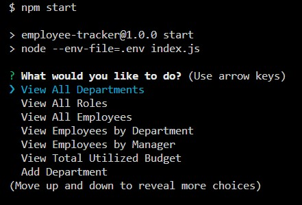

# Employee-Tracker   

## Description

A command line application to keep track of your employee database. It allows you to view your departments, roles, and employees as well as modifying those values.

[Video Submission](https://www.youtube.com/watch?v=W5N8sPW3XVs)

## Table of Contents

- [Installation](#installation)
- [Usage](#usage)
- [License](#license)
- [Contributing](#contributing)
- [Questions](#questions)


## Installation

require a local mySQL server [Download here](https://dev.mysql.com/downloads/)

clone the repo and
```npm install```

Create a mySQL database by connecting to your sql server in  the terminal

```mysql -u <username> -p```

run the commands

```source ./db/schema.sql``` and ```source ./db/seeds.sql```


## Usage


```npm start``` and follow the prompts



## License

**Employee-Tracker** is licensed under the [MIT license](https://github.com/sareacct91/{data.githubRepoName}/blob/master/LICENSE)

## Contributing

[Contributor Covenant](https://www.contributor-covenant.org/)


## Questions

https://github.com/sareacct91

If you have any questions email me at sareacct91@gmail.com
